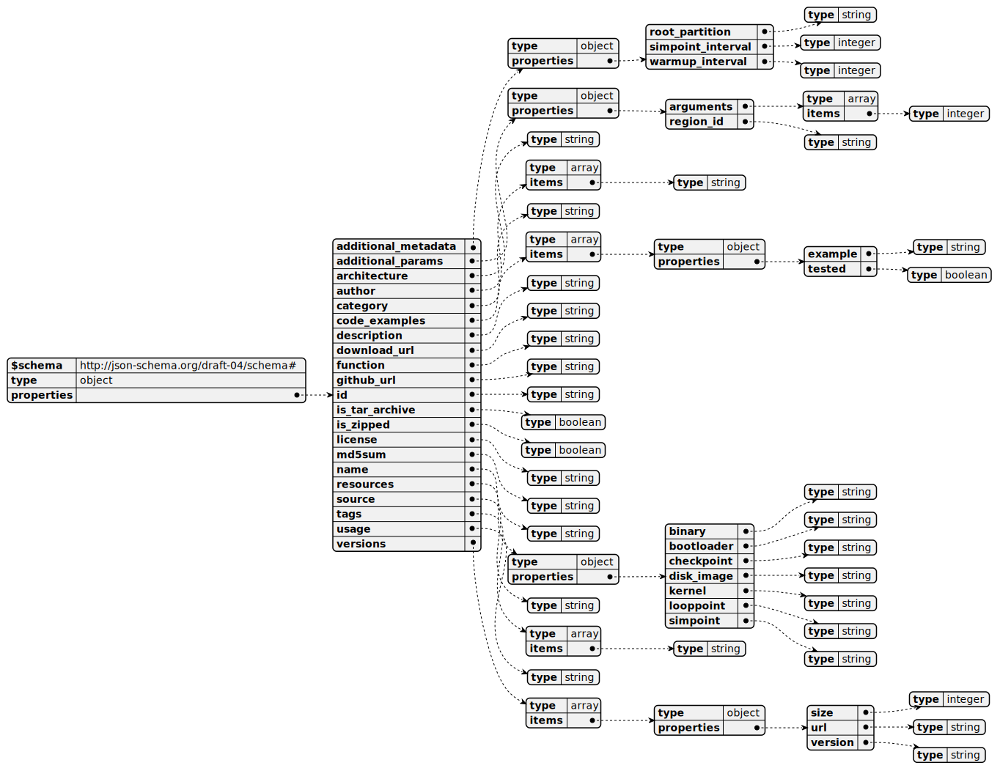

# gem5 Vision Website
## UML for the Schemas
MongoDB UML for the schemas used in the project.

JSON UML for the schemas used in the project.


## Running it locally

First, run the development server:

```bash
npm run dev
# or
yarn dev
# or
pnpm dev
```

Open [http://localhost:3000](http://localhost:3000) with your browser to see the result.
