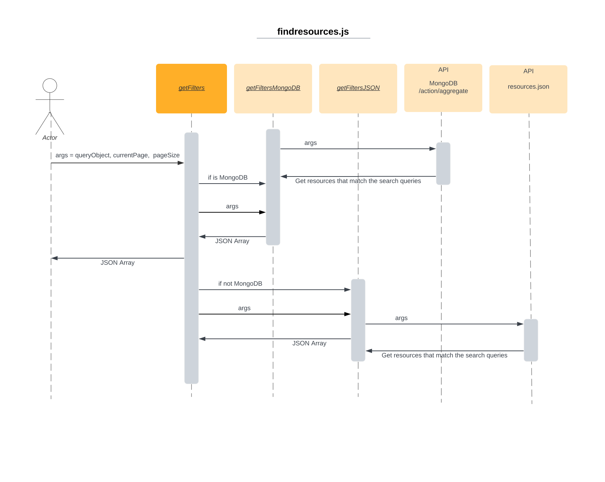

# API Documentation for Static Website

This is a collection of JavaScript files that function as the API for resource management. The API provides functions for searching, filtering, and fetching resources from a database. The implementation of the database can be either MongoDB or JSON, depending on the value of the `process.env.RESOURCES.isMongo` environment variable.

## Files

The API is composed of the following files:

- `getResourcesByQuery.js`: This file contains a wrapper function that invokes the `getResourcesByQuery` function for either MongoDB or JSON, depending on the value of `isMongo` of the Resource config. The `getResourcesByQuery` function is used for searching resources based on a query. It also takes in other parameters like `currentPage` and `nPerPage` which aid in pagination.

- `getFilters.js`: This file contains a wrapper function that invokes the `getFilters` function for either MongoDB or JSON, depending on the value of `isMongo` of the Resource config. The `getFilters` function is used for fetching the filtering options present on the website dynamically.

- `getResourceByID.js`: This file contains a wrapper function that invokes the `getResourceByID` function for either MongoDB or JSON, depending on the value of `isMongo` of the Resource config. The `getResourceByID` function is used for finding a resource by its exact ID, and throws an error if the database is invalid.

- `getVersionsByID.js`: The `getVersionsByID` function retrieves versions of a resource with the given ID from a specified database. It determines the type of database by the value of `isMongo` property in the environment variable. If `isMongo` is true, it calls the `getVersionsByIDMongoDB` function to fetch versions from a MongoDB database. Otherwise, it calls the `getVersionsByIDJSON` function to fetch versions from a JSON file.

- `getTabs.js`: The `getTabs` function takes in a JSON object res and returns an object with information about the required, optional, and metadata fields for a specific category. The function first fetches a schema from a specified URL, then recursively calls a helper function getRequiredFields() to determine which fields are required and which are optional for the given category. It then adds the required and optional fields from the schema to the respective arrays, removes any duplicate fields, removes any fields that are not in the resource, and adds the content of the fields to the corresponding objects in the arrays. Finally, it uses a tabs object to determine which fields should be in which tab and returns the required, optional, and metadata fields grouped accordingly.

## getResourcesByQuery(queryObject, currentPage, pageSize) ⇒ <code>json</code>

Wrapper function to fetch the resources based on the query object.

**Kind**: global function  
**Returns**: <code>json</code> - The resources in JSON format. 

| Param | Type | Description |
| --- | --- | --- |
| queryObject | <code>json</code> | The query object. |
| currentPage | <code>number</code> | The current page number. |
| pageSize | <code>number</code> | The number of resources to be displayed per page. |

## getFilters() ⇒ <code>json</code>

Gets the filters from the database.

**Kind**: global function  
**Returns**: <code>json</code> - A json object with the filters.  

## getResourceByID(id, database, version) ⇒ <code>json</code>

Fetches a resource from the MongoDB database or JSON file.

**Kind**: global function  
**Returns**: <code>json</code> - The resource in JSON format.  

| Param | Type | Description |
| --- | --- | --- |
| id | <code>string</code> | The id of the resource to be fetched. |
| database | <code>string</code> | The database of the resource from which the id should be fetched. |
| version | <code>string</code> | The version of the resource to be fetched. |

## getVersionsByID(id, database) ⇒ <code>json</code>
Returns an object with information about the versions of a resource with the given ID from a specified database.

**Kind**: global function  
**Returns**: <code>json</code> - The versions in JSON format.  

| Param | Type | Description |
| --- | --- | --- |
| id | <code>string</code> | The id of the resource to be fetched. |
| database | <code>string</code> | The database of the resource from which the id should be fetched. |

## getTabs(res) ⇒ <code>json</code>
Returns an object with information about the required, optional, and metadata fields for a specific category

**Kind**: global function  
**Returns**: <code>json</code> - Contains the required, optional and metadata tabs.  

| Param | Type | Description |
| --- | --- | --- |
| res | <code>string</code> | The config for where the schema properties should lie ("required", "optional" or "metadata") |
